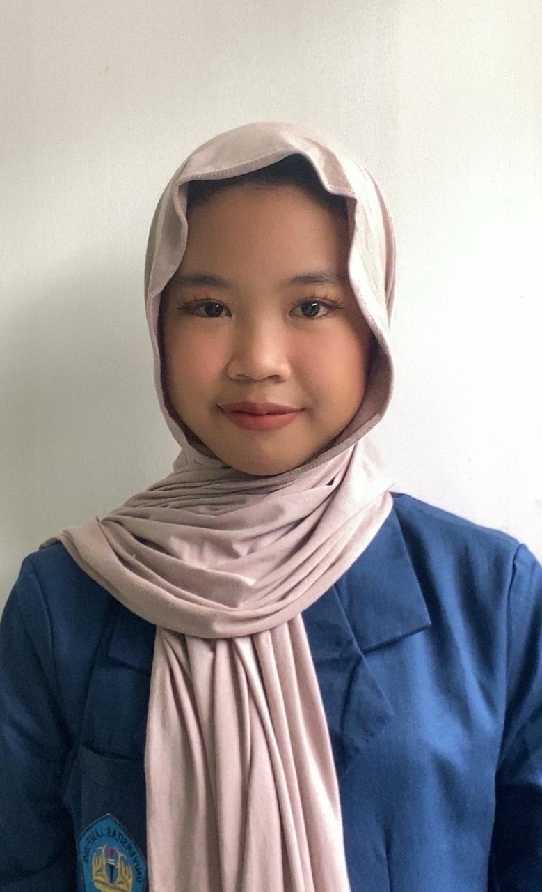

<!DOCTYPE html>
<html lang="id">
<head>
	<meta charset="UTF-8">
	<title>Tugas Grafika Komputer PTI</title>
	
</head>

<body>
	<header>
		<h1>Grafika Komputer Syifa Nur Ramadhani</h1>
	</header>

	<ul>
		<li><a href="#">Beranda</a></li>
		<li><a href="#profil">Profil</a></li>
		<li><a href="#">Tentang</a></li>
	</ul>	

	<section id="profil" class="profil">
		
		<h2>Syifa Nur Ramadhani</h2>
        <h2>NPM: 2413025019</h2>
		
Halo! Saya mahasiswa PTI yang sedang mempelajari mata kuliah Grafika Komputer. Di halaman ini, kamu bisa melihat berbagai tugas saya yang dikumpulkan dalam bentuk laporan PDF dan video. Terima kasih telah berkunjung! 💗

	</section>

	<section>
		
<strong>Tugas 1</strong>
			 <a href="files/Tokoh.pdf">Laporan PDF</a>
			 <a href="https://drive.google.com/file/d/1soPdPBa1z7QB9YSMwwnTabk5bIzRCH7L/view?usp=drive_link">Video</a>
			
		

		
<strong>Tugas 2</strong>
			 <a href="files/Garis.pdf">Laporan PDF</a>
			 <a href="https://drive.google.com/file/d/1x7bre_0bLeULsWzrROsYovoMSrDoukmq/view?usp=sharing">Video</a>
			
		

		
<strong>Tugas 3</strong>
			 <a href="files/Lingkaran.pdf">Laporan PDF</a>
			 <a href="https://drive.google.com/file/d/197DhXJC35zZmnLEX766WZGcuJ0jb4nkw/view?usp=drive_link">Video</a>
			
		

	</section>

	<footer>
		
Hak Cipta &copy; Syifa Nur Ramadhani

	</footer>
</body>
</html>
